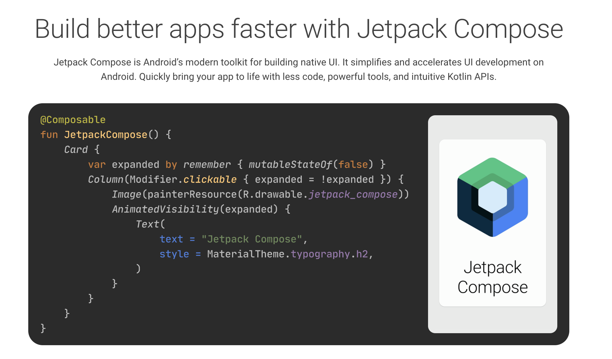

Jetpack Compose是Google在2019年推出的一个现代化UI框架，最近终于进入beta阶段，Google I/O 2021透露将在7月发布稳定版。对标iOS Swift UI，可以预见安卓UI开发方式也将迎来巨变，是时候调研一波了。
<!-- more -->

### 第一印象

以上是官网首页的代码片段，用一个方法实现了一个带图片和动画的卡片。满满的flutter/swift UI既视感，熟悉的嵌套，熟悉的kotlin的lambda表达式，第一印象，熟悉，简洁！

再一看，几行代码涵盖了layout，style，animation，image asset，state处理这些UI基本元素，UI用到的元素都有了，可以实战了。框架完成度，高！

把一个Kotlin方法加上@Composable注解，就是一个compose方法了。多个compose方法嵌套组合下，就可以实现复杂的UI，compose=组合。注解隐藏了实现细节，使用者可以更加focus在UI本身的实现上了。

### Pros

- Declarative programing，声明式的写法，学过React/Flutter/Swift UI的同学应该很熟悉。Learn once，apply everywhere，棒！(其实Android的databinding框架，已经让我们体验了类似的写法。单独看xml layout，这是是一个declarative的ui，描述了页面的样式，databinding注入状态，状态变化时会触发UI更新。从结果看就是一种declarative programing的写法(伪。。)
- 基于Kotlin，pure code UI implementation。Kotlin的语法糖还是很香的。没有了koltin/java+xml ui，ui代码全部用kotlin code实现，降低了复杂度。同样的，UI规则更加纯粹，相信以后机器就可以更好的自动生成UI代码了。参考Adobe xd的flutter插件，设计⇒代码，so easy！
- Open source，吸收各方优点。当然，闭源的swift ui搞的也不错，目前进度和质量都领先于compose，已经是生产环境新APP的UI标配了。
- Multi-platform
  - [Compse for Desktop](https://www.jetbrains.com/lp/compose/)
  - [Compose for Web](https://compose-web.ui.pages.jetbrains.team/)
- View interop, 可以在原有的view里包裹compose，也可以在compose中嵌套原来的view。同样的，UI之外的框架也可以复用，比如viewmodel，livedata，coroutines。老项目也可以使用最新的UI框架，兼容性高。
- Decouple from OS, 对android系统版本没有要求，而swift UI需要iOS 13+系统要求。意味着我们用compose写的代码可以运行在任意版本的android系统上。

### Cons

- Performance concern：compose方法可能会调用很频繁，最频繁的时候没一帧都会调用。这中间可能会有很多的计算，也可能会有很多中间调用产生的小对象。参考flutter widget，这些对象回收可能会产生额外的耗费。
- UI组件少：全新的UI框架，原生和三方的UI组件都很欠缺，成熟度还有待考证。
- 嵌套问题：复杂UI页面，UI嵌套不可避免，嵌套的代码需要很好的组织和管理，可以从flutter，react吸取点经验。

### TLDR
- 基于kotlin，和原生view和框架可以无缝对接。  
- 一个跨平台（Android/Web/Desktop）UI框架。  
- 一个开源的，吸取众家之长的UI框架，值得期待。