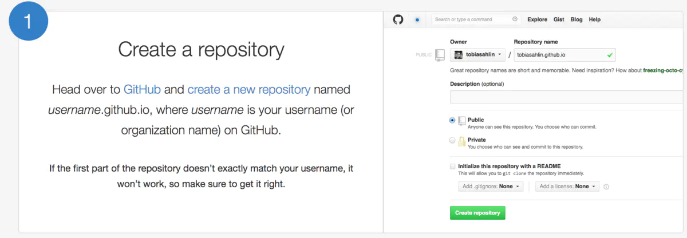

#### 概述
使用github page + hexo搭建博客最佳实践。md文件和生成的博客网站文件分开管理，推送到各自的仓库保存。三步即可完成博客创建到发布并留档。
1. `hexo new "new blog title"` 写md文件
2. `hexo g -d` 生成静态博客网站文件并部署到github page
3. `git commit -am "save" && git push` 推送md文件到github
<!-- more -->

#### 环境   
- MacOs 
- Git 
- NodeJs
- Hexo-cli

#### 准备工作
1. 安装NodeJs [NodeJs官网下载](https://nodejs.org/zh-cn/download/)
2. 安装hexo-cli  
```
npm install -g hexo-cli
```
3. 创建一个普通 [github repo](https://github.com/gnehz972/hexoblog) 用来放md原始文件
4. 创建github page repo，用来放生成的静态网页文件 [github page](https://pages.github.com/)
>注意repo name必须为你的用户名＋.github.io(*eg: gnehz972.github.io*)
>

#### 创建hexo工程开始写作
1. 初始化hexo工程
```
hexo init hexoblog
```
2. 新建博客文章
```
hexo new "new blog"
```
会看到创建成功的md文件存放在./source/_posts/目录下，编辑md文件写blog，blabla...
>INFO  Validating config  
>INFO  Created: ~/dev/blog/hexoblog/source/_posts/new-blog.md
3. 将md文件转换成静态网页文件，生成的网页文件位于./public/目录下
```
hexo generate
```
4. 本地预览网页
```
hexo server
```
可以看到以下信息，在浏览器访问http://localhost:4000/ 即可看到新建的博客页面
>INFO  Validating config  
>INFO  Start processing  
>INFO  Hexo is running at http://localhost:4000/ . Press Ctrl+C to stop.

#### 部署博客静态网页到github page

1. 修改配置文件_config.yml，配置部署信息。这里配之前创建的github page repo信息
```
deploy:
  type: git
  repo: https://github.com/gnehz972/gnehz972.github.io.git
  branch: master
```
2. 部署到github page
```
hexo g -d
```
3. 验证部署，访问 [https://gnehz972.github.io/](https://gnehz972.github.io/)

#### md源文件管理
1. 将hexoblog工程push到github即可
```
cd hexoblog
git init 
git remote add origin https://github.com/gnehz972/hexoblog.git
git add .
git commit  -am "init repo"
git push -u origin master 
```

#### 更换主题
1. 添加hexo-theme-next主题
```
npm install hexo-theme-next
```
2. 修改_config.yml配置文件theme
```
theme: next
```

